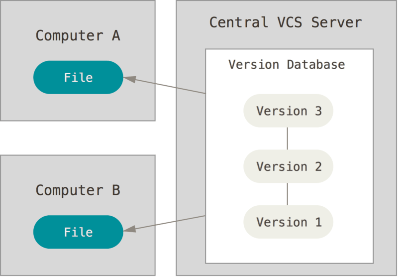

## Обзор

1. О системе контроля версий

Что такое "система контроля версий" и почему это важно? Система контроля версий - это система, которая записывает изменения в файл или набор файлов с течением времени и позволяет вам позже вернуться к определенной версии. Для контроля версий файлов в этой книге в качестве примера будет использоваться исходный код программного обеспечения, хотя на самом деле вы можете использовать контроль версий практически для любого типа файлов.

Если вы графический или веб—дизайнер и хотите сохранять каждую версию изображения или макета (скорее всего, вы это сделаете), система контроля версий (далее именуемая SLE) - как раз то, что вам нужно. Это позволяет вам вернуть файлы в состояние, в котором они были до изменений, вернуть проект в исходное состояние, просмотреть изменения, посмотреть, кто в последний раз что-то менял и вызвал проблему, кто поставил задачу и когда, и многое другое. Использование SLE также в целом означает, что если вы что-то сломали или потеряли файлы, вы можете безопасно все исправить. В дополнение ко всему, вы получите все это без каких-либо дополнительных усилий.

2. Локальные системы контроля версий

Многие люди используют копирование файлов в отдельный каталог в качестве метода контроля версий (возможно, даже в каталог с отметкой времени, если они достаточно умны). Этот подход очень распространен из-за своей простоты, но он невероятно подвержен ошибкам. Вы можете легко забыть, в каком каталоге вы находитесь, и случайно изменить неправильный файл или скопировать не те файлы, которые вы хотели.

Чтобы решить эту проблему, программисты давно разработали local SLE с простой базой данных, которая хранит записи обо всех изменениях в файлах, тем самым отслеживая изменения.

*Рисунок 1. Локальный контроль версий*

3. Централизованные системы контроля версий

Следующая серьезная проблема, с которой сталкиваются люди, - это необходимость взаимодействия с другими разработчиками. Чтобы справиться с этим, были разработаны централизованные системы управления версиями (CSKA). Такие системы, как CVS, Subversion и Perforce, используют единый сервер, содержащий все версии файлов, и ряд клиентов, которые получают файлы из этого централизованного хранилища. Использование ЦСКА было стандартом на протяжении многих лет.

*Рисунок 2. Централизованное управление версиями*

Этот подход имеет много преимуществ, особенно по сравнению с локальной СКВ. Например, все разработчики проектов в определенной степени знают, что делает каждый из них. Администраторы имеют полный контроль над тем, кто что может делать, и гораздо проще администрировать CSCS, чем управлять локальными базами данных на каждом клиенте.

Несмотря на это, такой подход также имеет серьезные недостатки. Наиболее очевидным недостатком является единая точка отказа, представленная централизованным сервером. Если этот сервер выйдет из строя на час, то в течение этого времени никто не сможет использовать систему управления версиями для сохранения изменений, над которыми они работают, и никто не сможет поделиться этими изменениями с другими разработчиками. Если жесткий диск, на котором хранится центральная база данных, поврежден, и нет своевременных резервных копий, вы потеряете все — всю историю проекта, не считая отдельных снимков репозитория, которые были сохранены на локальных машинах разработчика. Локальные SLE страдают от той же проблемы: когда вся история проекта хранится в одном месте, вы рискуете потерять все.

4. Распределенные системы контроля версий

Именно здесь в игру вступают распределенные системы контроля версий (RSCs). В RSKV (таких как Git, Mercurial, Bazaar или Darcs) клиенты не просто загружают снимок всех файлов (состояние файлов на определенный момент времени) — они полностью копируют репозиторий. В этом случае, если один из серверов, через который разработчики обменивались данными, умирает, любой клиентский репозиторий может быть скопирован на другой сервер для продолжения работы. Каждая копия хранилища представляет собой полную резервную копию всех данных.

*Рисунок 3. Распределенный контроль версий*

Более того, многие RSCs могут одновременно взаимодействовать с несколькими удаленными репозиториями, благодаря этому вы можете работать с разными группами людей, используя разные подходы одновременно в рамках одного и того же проекта. Это позволяет применять сразу несколько подходов к разработке, например, иерархические модели, что совершенно невозможно в централизованных системах.

5. Что такое Git?

Короче говоря, что такое Git? Очень важно понять эту часть материала, потому что, если вы понимаете, что такое Git и основы того, как он работает, вам может быть намного проще его использовать. Пока вы изучаете Git, постарайтесь забыть все, что вы знаете о других SLE, таких как Subversion и Perforce. Это позволит вам избежать определенных проблем при использовании инструмента. Git хранит и использует информацию совершенно по-другому по сравнению с другими системами, хотя пользовательский интерфейс довольно похож, и понимание этих различий поможет вам избежать путаницы во время использования.

**Моментальные снимки, а не различия**

Главное отличие Git от любого другого SLE (включая Subversion и его собратьев) — это подход к работе с вашими данными. Концептуально большинство других систем хранят информацию в виде списка изменений в файлах. Эти системы (CVS, Subversion, Perforce, Bazaar и т.д.) Представляют сохраненную информацию в виде набора файлов и изменений, вносимых в каждый файл с течением времени

**Почти все операции выполняются локально**

Для большинства операций в Git достаточно локальных файлов и ресурсов — в принципе, системе не нужна никакая информация с других компьютеров в вашей сети. Если вы привыкли к CSKA, где большинство операций страдают от задержек из-за работы с сетью, то этот аспект Git заставит вас подумать, что боги скорости наделили Git неисчислимой силой. Поскольку вся история проекта хранится непосредственно на вашем локальном диске, большинство операций кажутся почти мгновенными.

**Целостность Git**

В Git для всего вычисляется хэш-сумма, и только после этого происходит сохранение. В будущем доступ к сохраненным объектам осуществляется с использованием этой хэш-суммы. Это означает, что невозможно изменить содержимое файла или каталога без ведома Git. Эта функциональность встроена в Git на низком уровне и является неотъемлемой частью его философии. Вы не потеряете информацию во время ее передачи и не получите поврежденный файл без ведома Git.

** Три государства**

А теперь слушай внимательно. Это самое важное, что нужно помнить о Git, если вы хотите, чтобы остальная часть процесса обучения прошла гладко. Git имеет три основных состояния, в которых могут находиться ваши файлы: измененные, проиндексированные и зафиксированные:

Измененные файлы включают файлы, которые были изменены, но еще не были зафиксированы.

Индексированный - это измененный файл в его текущей версии, помеченный для включения в следующую фиксацию.

Исправлено означает, что файл уже сохранен в вашей локальной базе данных.

We have come to the three main sections of the Git project: the working copy (working tree), the indexing area (staging area) and the Git directory (Git directory).
